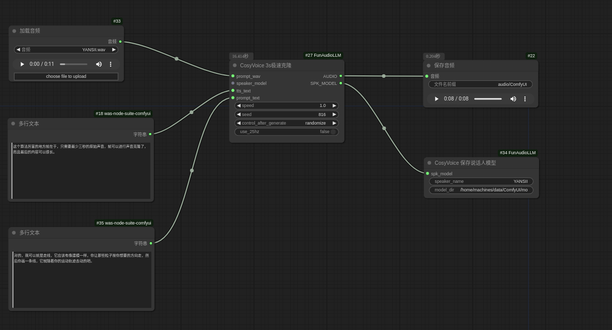
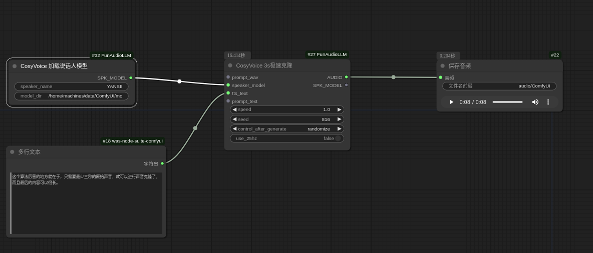
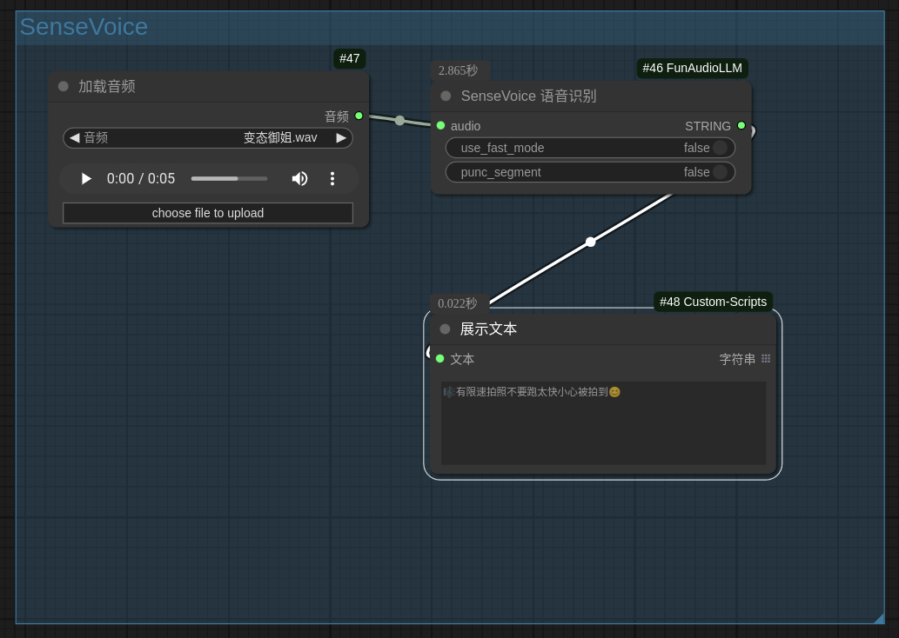
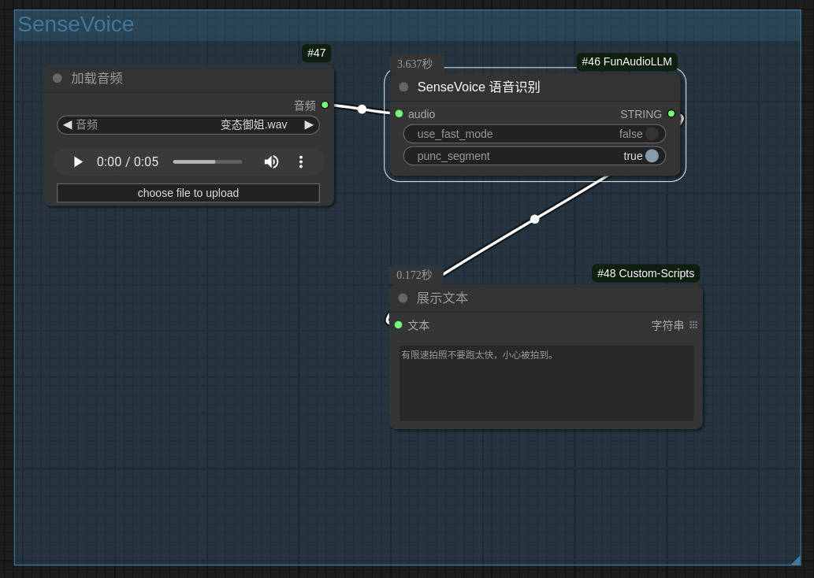
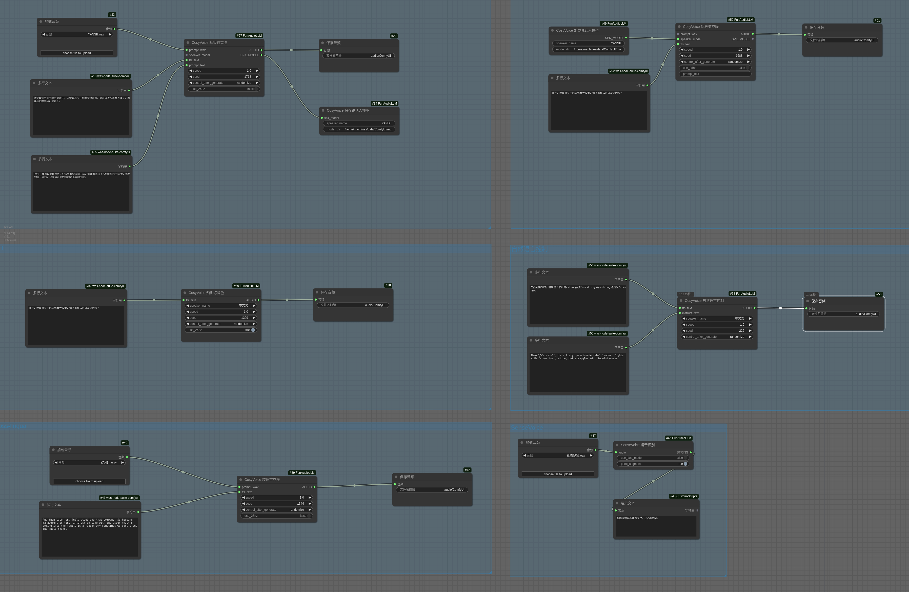

<!--
 * @Author: SpenserCai
 * @Date: 2024-10-04 11:28:28
 * @version: 
 * @LastEditors: SpenserCai
 * @LastEditTime: 2024-10-06 11:56:47
 * @Description: file content
-->
# ComfyUI-FunAudioLLM
Comfyui custom node for [FunAudioLLM](https://funaudiollm.github.io/) include [CosyVoice](https://github.com/FunAudioLLM/CosyVoice) and [SenseVoice](https://github.com/FunAudioLLM/SenseVoice)

## Features

### CosyVoice
  - CosyVoice Version: 2024-10-04
  - Support SFT,Zero-shot,Cross-lingual,Instruct
  - Support CosyVoice-300M-25Hz in zero-shot and cross-lingual
  - Support SFT's 25Hz(unoffical)
  - <details>
      <summary>Save and load speaker model in zero-shot</summary>
       <br>
      
    </details>

### SenseVoice
  - SenseVoice Version: 2024-10-04
  - Support SenseVoice-Small
  - <details>
      <summary>Support Punctuation segment (need turn off use_fast_mode)</summary>
       <br>
      
    </details>

## How use
```bash
apt update
apt install ffmpeg

## in ComfyUI/custom_nodes
git clone https://github.com/SpenserCai/ComfyUI-FunAudioLLM
cd ComfyUI-FunAudioLLM
pip install -r requirements.txt

```

### Windows
In windows need use conda to install pynini
```bash
conda install -c conda-forge pynini=2.1.6
pip install -r requirements.txt

```

If your network is unstable, you can pre-download the model from the following sources and place it in the appropriate directory.

- [CosyVoice-300M](https://modelscope.cn/models/iic/CosyVoice-300M) -> `ComfyUI/models/CosyVoice/CosyVoice-300M`
- [CosyVoice-300M-25Hz](https://modelscope.cn/models/iic/CosyVoice-300M-25Hz) -> `ComfyUI/models/CosyVoice/CosyVoice-300M-25Hz`
- [CosyVoice-300M-SFT](https://modelscope.cn/models/iic/CosyVoice-300M-SFT) -> `ComfyUI/models/CosyVoice/CosyVoice-300M-SFT`
- [CosyVoice-300M-SFT-25Hz](https://modelscope.cn/models/MachineS/CosyVoice-300M-SFT-25Hz) -> `ComfyUI/models/CosyVoice/CosyVoice-300M-SFT-25Hz`
- [CosyVoice-300M-Instruct](https://modelscope.cn/models/iic/CosyVoice-300M-Instruct) -> `ComfyUI/models/CosyVoice/CosyVoice-300M-Instruct`
- [SenseVoiceSmall](https://modelscope.cn/models/iic/SenseVoiceSmall) -> `ComfyUI/models/SenseVoice/SenseVoiceSmall`
     
## WorkFlow

